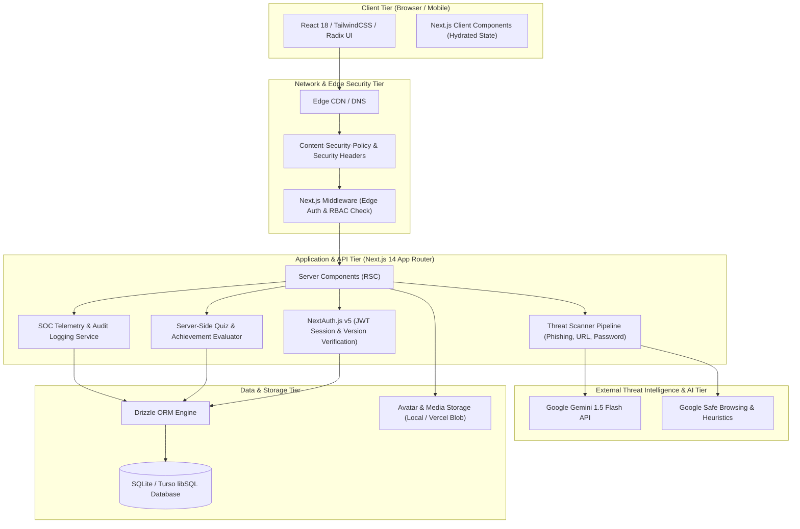
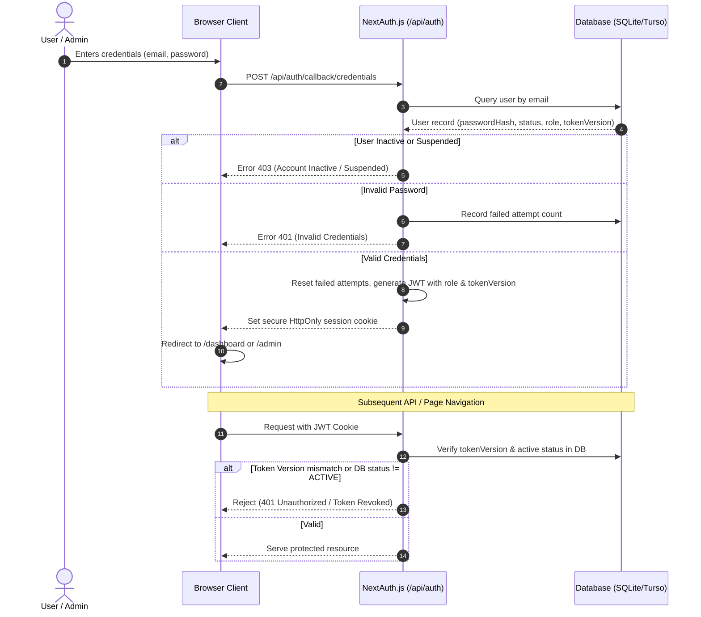
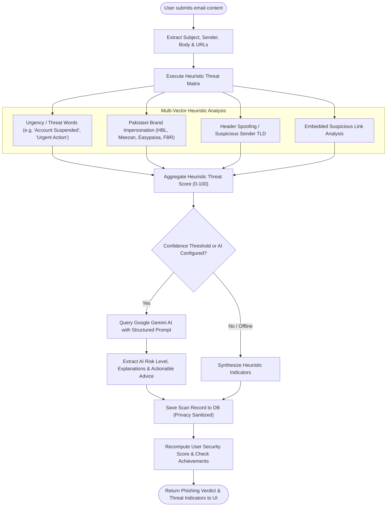
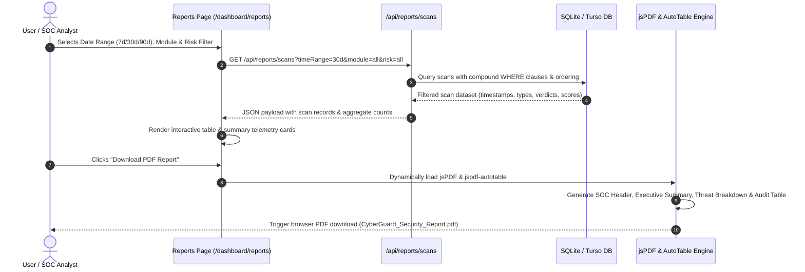

# 🏛️ CyberGuard AI — System Architecture & Design Blueprint

This document details the architectural design, security boundaries, component decomposition, and end-to-end data flows for the **CyberGuard AI** platform.

---

## 1. High-Level System Architecture



---

## 2. Authentication & Session Lifecycle Flow



---

## 3. Heuristic & AI Email Phishing Analysis Flow



---

## 4. SSRF-Resistant URL Security Scanner Flow

```mermaid
flowchart TD
    URLInput(["User Submits URL"]) --> Normalize["Normalize & Parse URL Scheme + Host"]
    Normalize --> SchemeCheck{"Scheme is HTTP or HTTPS?"}
    SchemeCheck -->|No (e.g., file://, gopher://, ftp://)| RejectSSRF["Reject: Invalid / Dangerous Protocol"]
    
    SchemeCheck -->|Yes| IPResolution["Resolve Hostname to Target IP Addresses"]
    IPResolution --> SSRFFilter{"Is IP Loopback, Private RFC1918, or Cloud Metadata?"}
    
    SSRFFilter -->|Yes (127.0.0.1, 10.0.0.0/8, 192.168.0.0/16, 169.254.169.254)| BlockSSRF["Block SSRF Attack Attempt"]
    
    SSRFFilter -->|No (Public IP)| BlocklistCheck{"Domain in Admin Blocklist?"}
    BlocklistCheck -->|Yes| BlockVerdict["Verdict: HIGH RISK / MALICIOUS (Blocklisted)"]
    
    BlocklistCheck -->|No| HeuristicRules["Analyze Brand Lookalikes, Homoglyphs & TLD Entropy"]
    HeuristicRules --> SafeBrowsing["Evaluate Google Safe Browsing / Heuristics"]
    SafeBrowsing --> FinalScore["Compute Threat Score & Security Headers"]
    FinalScore --> SaveURL["Persist Scan to url_scans Table"]
    SaveURL --> OutputResult(["Display Safety Badge & Safety Breakdown"])
```

---

## 5. SOC Admin Management & Self-Protection Guard Flow

```mermaid
flowchart TD
    AdminReq(["Admin Action (Edit Role, Deactivate, Delete)"]) --> RequireAdmin["requireAdminApi() Verification"]
    RequireAdmin --> DBCheck{"Caller is Active ADMIN in DB?"}
    
    DBCheck -->|No| DenyAdmin["403 Forbidden: Insufficient Privileges"]
    
    DBCheck -->|Yes| SelfGuard{"Target User ID == Caller Admin ID?"}
    
    SelfGuard -->|Yes (Self-Target)| ActionCheck{"Attempting Delete, Deactivation or Demotion?"}
    ActionCheck -->|Yes| BlockSelf["Reject: ADMIN_CANNOT_DELETE_SELF / DEMOTE_SELF"]
    ActionCheck -->|No (Self-Profile Update)| AllowMutation["Execute Mutation in DB"]
    
    SelfGuard -->|No (Different User)| AllowMutation
    AllowMutation --> AuditLog["Record Entry in audit_logs Table"]
    AuditLog --> Complete(["Return Success Response to Admin UI"])
```

---

## 6. Report Generation & Forensics Export Flow



---

## 7. Component Layering & Code Modularity

- **`src/app/`**: Next.js App Router presentation layer. Routes are split between authenticated user dashboard (`/dashboard/*`), public onboarding (`/`, `/login`, `/signup`), and SOC management (`/admin/*`).
- **`src/services/`**: Pure business logic modules isolated from HTTP request objects. Every service can be tested directly with unit tests without mocking Next.js server context.
- **`src/db/`**: Schema definitions, Drizzle ORM client initialization, migration configuration, and seed scripts.
- **`src/lib/`**: Reusable security primitives including password hashing, token validation, rate limiters, SSRF checkers, and avatar storage wrappers.
- **`src/components/ui/`**: Headless, accessible Radix UI component primitives wrapped with CyberGuard AI design tokens.
