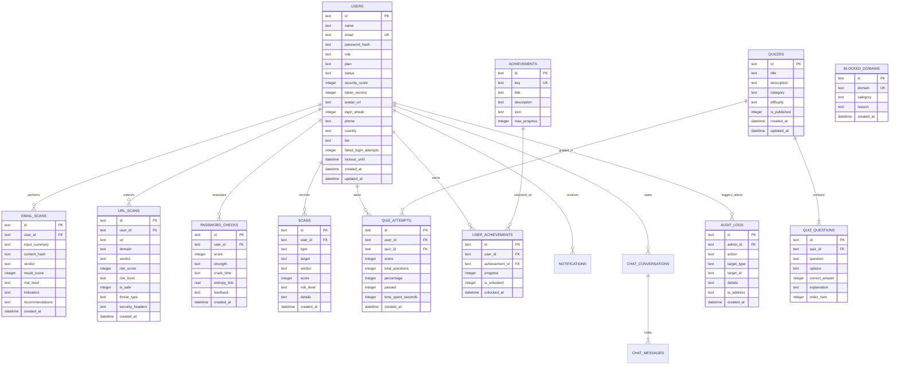

# 🗄️ CyberGuard AI — Database Architecture & ERD Specification

CyberGuard AI uses **Drizzle ORM** with a portable schema supporting **local SQLite** (`better-sqlite3` / `cyberguard.db`) and **Turso libSQL** (`@libsql/client`) for serverless cloud deployments.

---

## 1. Entity-Relationship Diagram (ERD)



---

## 2. Table Specifications & Indexes

### `users`
- **Primary Key**: `id` (text UUID)
- **Unique Indexes**: `users_email_idx` on `email`
- **Fields**:
  - `role`: `'USER'` | `'ADMIN'`
  - `plan`: `'FREE'` | `'PREMIUM'` | `'ENTERPRISE'`
  - `status`: `'ACTIVE'` | `'INACTIVE'` | `'SUSPENDED'`
  - `token_version`: Integer incremented on password resets / deactivations to invalidate active JWTs.

### `email_scans`
- **Foreign Key**: `user_id` $\to$ `users.id` (`ON DELETE SET NULL`)
- **Privacy Guarantees**: Raw email body is omitted. Stores only `input_summary` (sanitized header/preview), `content_hash` (SHA-256), `verdict`, and `risk_level`.

### `url_scans`
- **Foreign Key**: `user_id` $\to$ `users.id` (`ON DELETE SET NULL`)
- **Index**: `url_scans_domain_idx` on `domain` for fast reputation lookups.

### `quizzes` & `quiz_questions`
- **Cascade**: `quiz_questions.quiz_id` $\to$ `quizzes.id` (`ON DELETE CASCADE`).
- **Options**: JSON-serialized string array `["Option A", "Option B", "Option C", "Option D"]`.

### `audit_logs`
- **Foreign Key**: `admin_id` $\to$ `users.id` (`ON DELETE SET NULL`)
- **Purpose**: Non-repudiation audit trail for user role promotions, deactivations, domain blocklist changes, and policy modifications.

---

## 3. Database Management Commands

```bash
# Push schema updates directly to the connected database
npm run db:push

# Generate Drizzle migration SQL files
npm run db:generate

# Execute pending migrations
npm run db:migrate

# Seed database with realistic demo accounts and threat records
npm run db:seed

# Open local Drizzle Studio GUI
npm run db:studio
```
