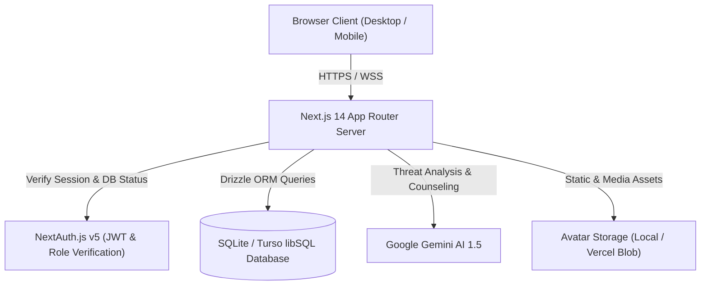

# 🛡️ CyberGuard AI — Next-Gen AI-Powered Cybersecurity Defense Platform

[](https://nextjs.org/)
[](https://www.typescriptlang.org/)
[](https://tailwindcss.com/)
[](https://orm.drizzle.team/)
[](https://vitest.dev/)
[](https://playwright.dev/)
[](LICENSE)

**CyberGuard AI** is a state-of-the-art cybersecurity awareness, threat intelligence, and behavioral protection platform. Built with Next.js 14 App Router, TypeScript, Drizzle ORM (SQLite / Turso libSQL), and Gemini AI intelligence, CyberGuard AI empowers individuals and security operations teams (SOC) with real-time heuristic email phishing detection, SSRF-resistant URL reputation analysis, zxcvbn password entropy auditing, gamified cyber training quizzes, interactive AI security counseling, and enterprise admin telemetry.

---

## 📑 Table of Contents
- [✨ Key Features](#-key-features)
- [🏗️ System Architecture](#️-system-architecture)
- [🛠️ Tech Stack](#️-tech-stack)
- [🚀 Quick Start & Installation](#-quick-start--installation)
- [⚙️ Environment Variables](#️-environment-variables)
- [📜 NPM Scripts](#-npm-scripts)
- [📂 Project Folder Structure](#-project-folder-structure)
- [🛡️ Security & Privacy Guarantees](#️-security--privacy-guarantees)
- [🧪 Testing Suite](#-testing-suite)
- [📸 Application Screens](#-application-screens)
- [⚠️ Current Limitations](#️-current-limitations)
- [🔮 Future Roadmap](#-future-roadmap)
- [📄 License & Authors](#-license--authors)

---

## ✨ Key Features

### 1. 📧 Heuristic & AI Email Phishing Analyzer (`/dashboard/email-checker`)
- **Multi-Vector Threat Engine**: Identifies urgency triggers, brand impersonation, spoofed headers, payment diversion scams, and credential harvesting patterns.
- **Privacy-Preserving Sanitization**: Raw email bodies are evaluated in-memory and omitted from administrative logs (only previews, verdicts, and SHA-256 signatures are retained).
- **Targeted Defense**: Specialized detection rules tailored for Pakistani banking/wallets (HBL, Meezan, Easypaisa, JazzCash, FBR tax scams).

### 2. 🌐 SSRF-Resistant Malicious URL Scanner (`/dashboard/url-checker`)
- **Defense-in-Depth Pipeline**:
  1. Local threat blocklist verification.
  2. Protocol & RFC 1918 Private IP / Cloud Metadata (`169.254.169.254`) SSRF rejection.
  3. Levenshtein distance brand lookalike & homoglyph detection (e.g., `easypalssa.com`, `m33zan-bank.pk`).
  4. Redirection chain inspection & Google Safe Browsing / AI classification.

### 3. 🔑 Password Entropy & Breach Analyzer (`/dashboard/password-checker`)
- **Zero-Storage Privacy**: Passwords are analyzed purely client-side / in-memory and **never written to disk or logged**.
- **Entropy & Rule Checks**: NIST SP 800-63B conformance, offline dictionary patterns, sequential/keyboard walks, and crack time calculations across supercomputers and consumer GPUs.

### 4. 🤖 AI Security Advisor & Copilot (`/dashboard/assistant`)
- Multi-turn conversational security assistant powered by Google Gemini.
- Contextual advice on incident response, ransomware prevention, social engineering defense, and security hygiene.
- Strict prompt injection guardrails with system rule reinforcement.

### 5. 🎓 Gamified Cyber Quiz & Learning LMS (`/dashboard/quiz`)
- Multi-category quizzes covering Phishing, Social Engineering, Network Security, and Cryptography.
- **Server-Side Grading**: Questions are delivered without answers (`/api/quiz/start`) to prevent client inspection tampering; evaluated securely on the backend (`/api/quiz/submit`).
- Immediate per-question explanations, security tips, and achievement badges.

### 6. 📊 SOC Analytics, Reports & PDF Export (`/dashboard/reports`)
- Comprehensive scan history filtering (Date range, Module, Threat Level).
- Client-side forensic audit report generation with PDF export via `jspdf` and `jspdf-autotable`.

### 7. 👑 SOC Administrator Panel (`/admin`)
- **Strict Authorization**: Double-layer authorization checking user session role (`ADMIN`) and re-verifying active status in the database on every request.
- **Admin Self-Protection**: Enforced guards blocking self-deletion, self-demotion, or self-deactivation.
- **Audit Logging**: Immutable forensic record of administrative actions (`audit_logs`).
- **Domain Blacklist & AI Diagnostics**: Live threat intelligence management and AI health checks.

---

## 🏗️ System Architecture



---

## 🛠️ Tech Stack

| Layer | Technology |
|---|---|
| **Framework** | Next.js 14.2 (App Router, Server Components & Server Actions) |
| **Language** | TypeScript 5.6 (Strict Mode) |
| **Styling** | TailwindCSS 3.4, Radix UI Primitives, Lucide Icons, Framer Motion |
| **Authentication** | NextAuth.js v5 (Credentials Provider, JWT, Session Token Versioning) |
| **Database** | SQLite (`better-sqlite3` for local dev) / Turso libSQL (`@libsql/client` for serverless) |
| **ORM** | Drizzle ORM 0.33 with Drizzle Kit |
| **AI Intelligence** | Google Gemini API (`@google/genai`) |
| **PDF Generation** | jsPDF & jsPDF-AutoTable |
| **Testing** | Vitest 2.1 (Unit/Integration) & Playwright 1.47 (E2E) |

---

## 🚀 Quick Start & Installation

### Prerequisites
- Node.js 18.17.0+ or Node.js 20+
- npm, pnpm, or yarn

### 1. Clone & Install Dependencies
```bash
git clone https://github.com/your-username/cyberguard-ai.git
cd cyberguard-ai
npm install
```

### 2. Configure Environment
Create a `.env` file based on `.env.example`:
```bash
cp .env.example .env
```

### 3. Initialize & Seed Database
```bash
npm run db:push
npm run db:seed
```

### 4. Start Development Server
```bash
npm run dev
```
Open [http://localhost:3000](http://localhost:3000) in your browser.

---

## ⚙️ Environment Variables

```env
# Application
NEXT_PUBLIC_APP_URL="http://localhost:3000"
NEXTAUTH_URL="http://localhost:3000"
NEXTAUTH_SECRET="your-super-secret-random-jwt-key-min-32-chars"

# Database Configuration
# Local SQLite (default for development):
DATABASE_URL="file:./cyberguard.db"

# Or Remote Turso libSQL (for Production/Vercel):
# DATABASE_URL="libsql://your-database.turso.io"
# TURSO_AUTH_TOKEN="your-turso-auth-token"

# AI Service
GEMINI_API_KEY="your-gemini-api-key"
```

---

## 📜 NPM Scripts

| Command | Description |
|---|---|
| `npm run dev` | Starts Next.js development server with hot reload at port 3000 |
| `npm run build` | Builds optimized production bundle |
| `npm run start` | Runs production server |
| `npm run db:seed` | Seeds database with demo users, quizzes, tips, scans, and badges |
| `npm run db:push` | Pushes Drizzle ORM schema directly to database |
| `npm test` | Runs 79+ Vitest unit and service tests |
| `npm run test:e2e` | Runs Playwright end-to-end integration tests |
| `npx tsc --noEmit` | Runs strict TypeScript type-checking |

---

## 📂 Project Folder Structure

```
cyberguard-ai/
├── design-ref/               # 12 UX/UI Design Reference Screenshots
├── docs/                     # Software Engineering Documentation
│   ├── SRS.md                # Software Requirements Specification
│   ├── USE_CASES.md          # Formal Use Cases
│   ├── TEST_CASES.md         # 30+ Manual QA Test Cases
│   └── VIVA_NOTES.md         # Defense & Viva Presentation Guide
├── e2e/                      # Playwright End-to-End Test Suite
├── public/                   # Static Assets & SVGs
├── src/
│   ├── app/                  # Next.js 14 App Router Pages & API Endpoints
│   │   ├── (auth)/           # /login, /signup, /forgot-password, /reset-password
│   │   ├── admin/            # SOC Administrator Panel (/admin, /users, /quizzes, /reports, /settings)
│   │   ├── api/              # Secure REST APIs (/api/scan, /api/quiz, /api/user, /api/admin)
│   │   ├── dashboard/        # User Portal (/email-checker, /url-checker, /password-checker, /quiz, etc.)
│   │   └── page.tsx          # High-Impact Hero Landing Page
│   ├── components/           # Modular Reusable UI Components
│   │   ├── shared/           # Header, Sidebar, StatCard, EmptyState, Logo
│   │   └── ui/               # Radix UI + Tailwind Design System Components
│   ├── db/                   # Database Connection, Drizzle Schema, Migrations & Seeds
│   ├── lib/                  # Authentication Helpers, Security Utilities, Token Validation
│   ├── services/             # Core Business Logic (AI, Phishing, URL Safety, Quiz, Admin)
│   └── tests/                # 10 Vitest Test Suites (79 Unit Tests)
├── ARCHITECTURE.md           # Detailed Architecture & Technical Blueprint
├── SECURITY.md               # Security Hardening & Threat Model
├── API.md                    # Complete OpenAPI Endpoint Documentation
├── DATABASE.md               # Database Schema & Entity Relationship Diagram
├── DEPLOYMENT.md             # Production Deployment Guide (Vercel + Turso + Blob)
└── package.json              # Dependencies & Scripts
```

---

## 🛡️ Security & Privacy Guarantees

1. **Zero Secret Leakage**: Passwords and raw email contents are never stored in plain text or logged to standard output.
2. **SSRF Defense**: Strict filtering of loopback (`127.0.0.1`), link-local (`169.254.169.254`), and RFC 1918 private subnets prior to any external network queries.
3. **CSP & HTTP Security Headers**: HSTS, Content Security Policy, X-Content-Type-Options (`nosniff`), X-Frame-Options (`DENY`), and Referrer Policy enforced across all routes.
4. **Rate Limiting**: Sliding-window rate limiting on all public scanner endpoints and authentication routes.
5. **Session Invalidation**: Bumping `tokenVersion` immediately revokes all existing JWT sessions upon password reset or account deactivation.

---

## 🧪 Testing Suite

### Unit & Integration Tests (Vitest)
```bash
npm test
```
- `src/tests/auth.test.ts`: Password hashing, token versioning, credentials validation.
- `src/tests/phishing.test.ts`: Heuristic email analysis, urgency triggers, Pakistani bank scams.
- `src/tests/url-scanner.test.ts`: SSRF defense, homoglyph lookalikes, reputation scoring.
- `src/tests/password.test.ts`: Entropy calculations, character diversity, dictionary penalties.
- `src/tests/quiz.test.ts`: Server-side scoring, answer obfuscation.
- `src/tests/admin.test.ts`: RBAC enforcement, self-protection guards, telemetry counters.

### End-to-End Tests (Playwright)
```bash
npm run test:e2e
```

---

## 📸 Application Screens

| # | Screen | Description |
|---|---|---|
| **01** | Landing Page (`/`) | Hero introduction, live interactive demo, feature breakdown, FAQ |
| **02** | Login (`/login`) | Secure authentication with demo account one-click credentials |
| **03** | Sign Up (`/signup`) | Account registration with password strength meter |
| **04** | Dashboard (`/dashboard`) | Security score meter, threat telemetry, quick scanner actions |
| **05** | Email Checker (`/dashboard/email-checker`) | Heuristic & AI phishing detection with highlighted threat indicators |
| **06** | URL Scanner (`/dashboard/url-checker`) | SSRF defense, lookalike detection, and domain safety analysis |
| **07** | Password Analyzer (`/dashboard/password-checker`) | Real-time entropy evaluation, NIST rules, offline crack times |
| **08** | AI Security Copilot (`/dashboard/assistant`) | Interactive chatbot with contextual cybersecurity advice |
| **09** | Cyber Quiz LMS (`/dashboard/quiz`) | Gamified security training with server-graded scoring |
| **10** | Profile & Badges (`/dashboard/profile`) | Avatar upload, achievement showcase, security score |
| **11** | Admin Directory (`/admin/users`) | Filterable user directory, +Add User dialog, self-protection guards |
| **12** | Reports & Forensics (`/dashboard/reports`) | Forensic audit logs, filterable scan history, and PDF export |

---

## ⚠️ Current Limitations

- **Email Attachments**: Scans raw email headers and body text; binary parsing of macro-enabled Office files/PDF attachments requires sandboxed microservices in future iterations.
- **Local SQLite Persistence in Serverless**: Plain local SQLite files (`cyberguard.db`) are ephemeral on Vercel serverless functions; for production deployments, use Turso libSQL as documented in [`DEPLOYMENT.md`](file:///c:/Users/User/Desktop/Work/self/CS-Assistance/DEPLOYMENT.md).

---

## 🔮 Future Roadmap

- [ ] WebAuthn / FIDO2 Passkey Support.
- [ ] Automated Scheduled Phishing Simulation Campaigns for Enterprise Teams.
- [ ] Dark Web Compromised Credential Monitoring via HaveIBeenPwned API integration.
- [ ] Browser Extension for Real-Time On-Page Phishing Interception.

---

## 📄 License & Authors

Created by **Zohaib Amjad** as part of the CS Final Year Project (FYP). Released under the [MIT License](LICENSE).
