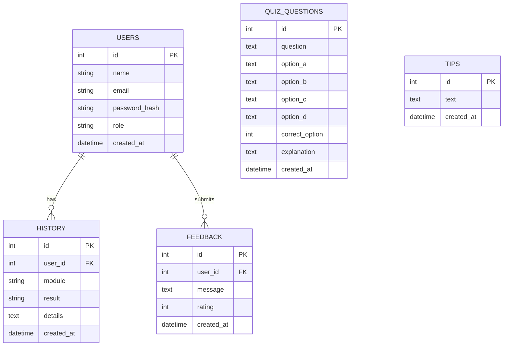

# ER Diagram

## Overview

The database is designed to store users, quiz questions, daily tips, user activity history, and feedback.

## Mermaid ER Diagram

## Database Explanation

- Users store account information and role.
- Quiz questions store MCQ content and answer explanations.
- Tips store daily cyber security messages.
- History stores what each user checked previously.
- Feedback stores ratings and comments submitted by users.
