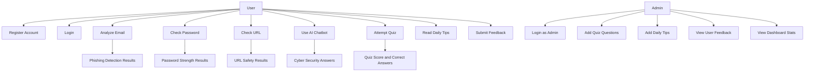

# Use Case Diagram

## Overview

This project includes multiple actors and use cases. The main user is a registered user, while the admin manages content and reviews feedback.

## Mermaid Diagram

## Use Cases

### User Use Cases
- Create account
- Login/logout
- Paste email for analysis
- Enter password for evaluation
- Enter URL for scanning
- Ask chatbot questions
- Take quiz
- View daily security tips
- Submit feedback

### Admin Use Cases
- Login with admin account
- Add quiz questions
- Add new tips
- View dashboard information
- View user feedback
